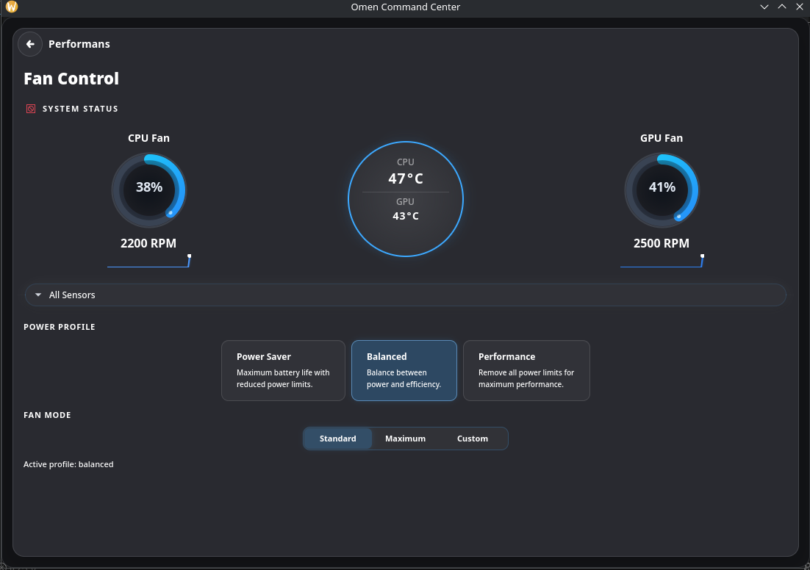

 # OMEN Command Center for Linux v1.3.0 #
<p align="center">
  

## 📖 About The Project
<p align="center">
  
  
</p>
<p align="center">
  
  
</p>
<p align="center">
  
  
</p>

**OMEN Command Center for Linux** is a native Linux application designed to unlock the full potential of HP Omen and Victus series laptops. It serves as an open-source alternative to the official OMEN Gaming Hub, providing essential controls in a modern, user-friendly interface.

**New in v1.3.0:**

- 🚀 **Completely Renewed Experience**: OMEN Command Center for Linux was fully renewed in v1.3.0 with a redesigned interface flow, updated page structure, and cleaner cross-page consistency.
- 📐 **Responsive UI Scaling**: All major pages now adapt to compact, normal, and spacious window sizes for better desktop and small-window usability.
- 🧭 **Navigation & Header Polish**: Inline page header/back behavior and launcher layout were refined for cleaner page transitions and more consistent navigation.
- 🌗 **Theme Consistency Improvements**: Light/dark mode readability and dropdown/popover styling were improved for clearer contrast and better visual stability.
- 🛠️ **Settings Reliability Updates**: Debug info actions and related settings labels were stabilized and aligned with translations.

**Previous in v1.2.4:**

- 🧰 **Kernel Synchronization**: Synced `hp-wmi` driver with the mainline Linux kernel. Added missing board IDs (`8A4D`, `8BCA`, `8C76`) for complete compatibility.
- 🧪 **MUX Switch Fix (Errno 22 Mitigation)**: Resolved `Invalid Argument (22)` errors during MUX switching on newer models by implementing a 4-byte payload fallback in the WMI query.
- ⌨️ **KDE Omen Key Shortcut**: The OMEN Key desktop shortcut now activates instantly on KDE Plasma (e.g., CachyOS) without requiring a reboot, using `qdbus` to reload global shortcuts.
- 🖱️ **Touchpad Keymap**: Restored touchpad toggle keymap support (`KEY_TOUCHPAD_OFF` / `KEY_TOUCHPAD_ON`).


## ✨ Features

### 🎨 RGB Lighting Control
- **4-Zone Control**: Customize colors for different keyboard zones.
- **Effects**: Static, Breathing, Wave, Cycle.
- **Brightness & Speed**: Adjustable parameters for dynamic effects.
- **Low-CPU Wave Engine**: On tested systems, wave mode CPU usage dropped from ~22-28% average to ~2% average in stress conditions.

### 📊 System Dashboard
- **Real-time Monitoring**: CPU/GPU temperatures and Fan speeds.
- **Performance Profiles**: One-click power profile switching (requires `power-profiles-daemon`).

### 🌪️ Fan Control
- **Standard Mode**: Intelligent software-controlled fan curve for balanced noise/performance.
- **Max Mode**: Forces fans to maximum speed for intensive tasks.
- **Custom Mode**: Drag-and-drop curve editor to create your own fan profiles.

### 🎮 GPU MUX Switch (BETA)
- Switch between **Hybrid**, **Discrete**, and **Integrated** modes.
- Backend can be selected from **Settings → GPU / MUX**.
- Auto mode now prefers `envycontrol` / `supergfxctl` / `prime-select` before HP WMI direct.
- ⚠️ Some hardware/BIOS combinations may still require reboot or vendor-specific tooling behavior.

### ⌨️ Desktop Shortcuts (Recommended)
 To minimize background resource usage, we have removed the active OMEN Key listener daemon. We highly recommend creating a **Custom Shortcut** in your Desktop Environment settings (GNOME, KDE, etc.):
 - **Command**: `hp-manager`
 - **Shortcut Key**: Your **OMEN Key** (detected as `KEY_PROG2`) or any preferred key combinations.
 This provides a much more responsive experience compared to a background listener thread.

## 🚀 Installation

### Prerequisites
- A Linux distribution (Ubuntu, Fedora, Arch, OpenSUSE, etc.)
- `git` installed

### Install
Open a terminal and run:

```bash
# Clone the repository
git clone https://github.com/yunusemreyl/OmenCommandCenterforLinux.git
cd OmenCommandCenterforLinux

# Run the installer (requires root)
chmod +x setup.sh
sudo ./setup.sh install
```
Note: For compatibility with older documentation, `sudo ./install.sh` redirects to `setup.sh install`.
Installation Warning ⚠️: We recommend restarting your computer after installation.

### Script Layout

Maintenance scripts are now organized under:

- `scripts/fixes/`
- `scripts/diagnostics/`
- `scripts/tests/`

Legacy entry points (`fix_hp_wmi.sh`, `fix_omen.sh`, `dump_log.sh`, `test_nvidia.py`) are kept at the repository root as compatibility wrappers.

The installer will automatically:
1. Detect your package manager and install dependencies.
2. Detect your kernel version and install the appropriate driver:
   - **Kernel ≥ 7.0**: Only installs `hp-rgb-lighting` (RGB). Fan control is provided by the stock `hp-wmi` module.
   - **Kernel < 7.0**: Installs both the custom `hp-wmi` driver (backported) and `hp-rgb-lighting`.
3. Install the daemon and GUI components.
4. Set up system services.
5. Provide a troubleshooting guide if issues occur.

## 🗑️ Uninstallation

To completely remove the application and its services:

```bash
cd OmenCommandCenterforLinux
sudo ./setup.sh uninstall
```

## 🐧 Compatibility

| Distribution | Status | Notes |
|--------------|--------|-------|
| **Ubuntu 24.04 LTS / Zorin OS / Pop!_OS / Linux Mint** | ✅ Verified | Full support via `apt` |
| **Fedora 42+ / Nobara** | ✅ Verified | Full support via `dnf` |
| **Arch Linux / CachyOS / Manjaro** | ✅ Verified | Full support via `pacman` |
| **OpenSUSE Tumbleweed** | ✅ Verified | Full support via `zypper` |


## 👨‍💻 Credits & Acknowledgments
- **Lead Developer**: [yunusemreyl](https://github.com/yunusemreyl)
- **Contributors**: [ja4e](https://github.com/ja4e), [babyinlinux](https://github.com/babyinlinux), [entharia](https://github.com/entharia) 
- **Kernel Module Development**: Special thanks to **[TUXOV](https://github.com/TUXOV/hp-wmi-fan-and-backlight-control)** for the `hp-wmi-fan-and-backlight-control` driver, which makes fan control possible.

## ⚖️ Legal Disclaimer
This tool is an independent open-source project developed by **yunusemreyl**.
It is **NOT** affiliated with or endorsed by **Hewlett-Packard (HP)**.
The software is provided “as is”, without warranty of any kind.

---
*Developed with ❤️ by yunusemreyl*
